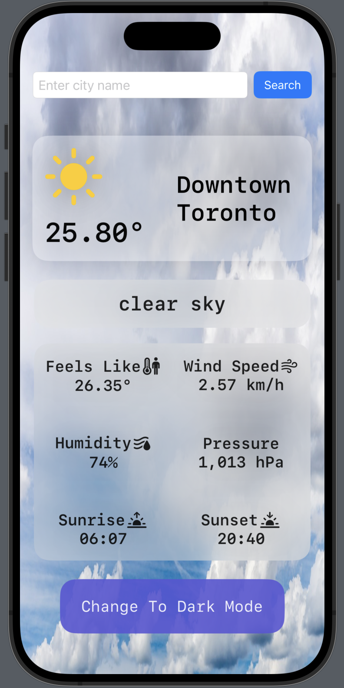
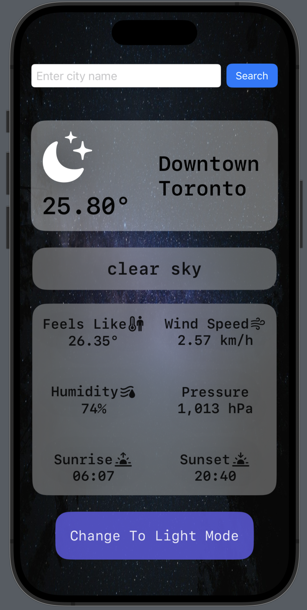

# Weather
A simple Weather app built using SwiftUI that fetches weather of a particular city.  
The app uses a simple api call to fetch the weather.  
Option to switch between light and dark mode and the view animates to the mode once the user taps the button to change the mode.   

## Getting the API Key to run the app  
Follow the steps:
1. Open the [openweathermap.org](https://openweathermap.org)
2. Create an account and get your personal api key
3. Replace <em>apiKey</em> in the <b>WeatherNetwork.swift</b> file with your api key

## Images for Light and Dark Mode  
 
