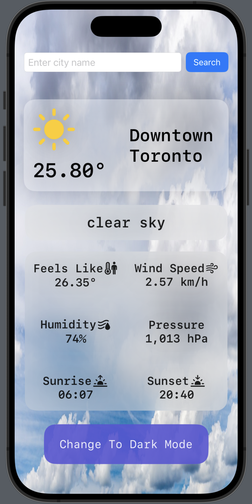
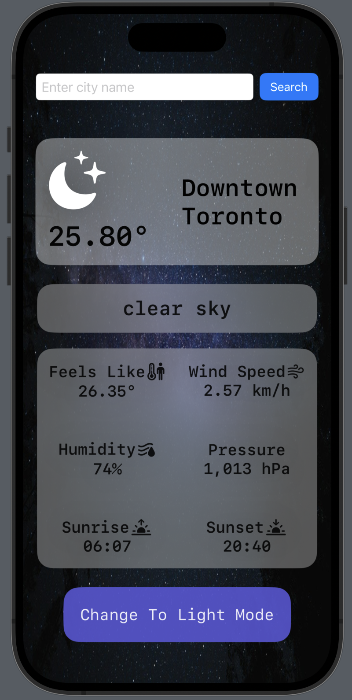

# 🌦️ Weather App  

A **SwiftUI Weather App** that fetches and displays the weather for a particular city using OpenWeatherMap API. The app supports **light** and **dark** mode, with smooth animations when toggling between modes.  

## 🚀 Features  

### ☁️ Fetching Weather Data  
- **Uses OpenWeatherMap API** to retrieve real-time weather data.  
- **Simple API call** to fetch weather details based on the entered city name.  

### 🎨 Dynamic UI with Light/Dark Mode  
- **Light & Dark Mode Support** → Users can switch between themes.  
- **Smooth Animations** → The view transitions seamlessly when toggling modes.  

### 🛠️ SwiftUI-Based UI  
- **Minimalistic & Clean Design** for an enhanced user experience.  
- **Animated Background Changes** based on the selected theme.  

## 🔑 Getting the API Key  

Follow these steps to obtain and integrate your **API Key**:  

1. Open **[OpenWeatherMap](https://openweathermap.org/)**.  
2. Create an account and navigate to the API section.  
3. Get your personal **API key**.  
4. Replace `apiKey` in the **WeatherNetwork.swift** file with your personal API key.  

## 🛠️ Technologies Used  
- **SwiftUI** for UI development  
- **OpenWeatherMap API** for fetching weather data  
- **Animations & Transitions** for smooth mode switching  

## 📷 Screenshots  
    

## 🔥 How to Run the Project  
1. Clone the repository:
```diff 
git clone https://github.com/parth49patel/Weather.git
```
2. Open the project in Xcode.
3. Replace the apiKey in WeatherNetwork.swift with your API key.
4. Run the app on a simulator or a real device. 

